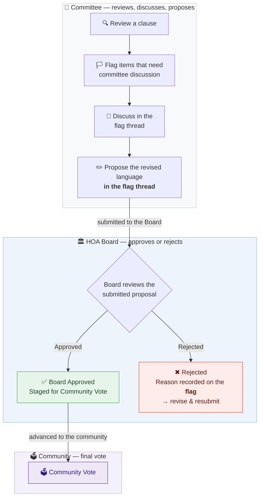

# Committee Member Workflow — PLCA Governing Documents Revision

**Who this is for:** members of the Document Revision Committee — community volunteers, plus a board member and an ARC member — working together to revise Plantation Lakes' governing documents.

**What this tool gives you:** the entire body of current governing documents, broken into ~712 individual clauses you can search, read, and discuss. You are revising the **documents themselves**, not this database: the database is simply the current documents laid out clause by clause so the committee can work through them. Your flags, discussions, and proposed language are the raw material for the new governing documents; once those are approved by the Board and ratified by the community, the database is updated to match. Everything you do is recorded, and nothing you do here can change what residents see.

---

## The big picture

**Committee Review → Committee Proposal → Board Approval / Rejection → Community Vote**

You handle the review, discussion, and proposal process inside the committee workflow, and all of it happens in revision flags. Final Board approval happens after the committee's proposal is submitted: the Board reviews the proposal and either approves or rejects it. If approved by the Board, the proposal is advanced to the community for final voting. If rejected, the reason is recorded on the flag so the proposal can be revised and resubmitted — a rejection is never a dead end, and the flag thread is where you regroup.

---

## Step 0 — Sign in

1. Go to **hoa-admin.onrender.com** and sign in with the username and temporary password you were given.
2. You'll be required to set your own password on first login.
3. Sessions last 8 hours. Five wrong password attempts locks the account for 15 minutes.

Your role in the tool is **Member**: Clauses, Search, Guide, Revision Flags, and Account. You will never see editing forms, approval queues, or database housekeeping — the committee changes the governing documents, not the database.

---

## Step 1 — Review the governing documents

The **Clauses** page (home) is the entire governing-document corpus, one clause at a time.

- **Search** by keyword — it looks through clause IDs, citations, document names, summaries, and full clause text.
- **Filter** by document (e.g. just the CC&Rs, just the Builders Guidelines) or by tag (e.g. FENCE, ARC).
- **Read clause** on any card expands the plain-English summary and the verbatim text. **Click any clause ID badge** to open that clause's own page: full text, summary, source link, and every flag that references it. This is the best page to read before flagging anything.
- **Precedence matters:** every clause has a precedence level, and *lower numbers mean higher authority* — 1 is Texas state law, 2 is the CC&Rs, down to 9 for the Builders Guidelines. When documents conflict, the lower number wins. Keep this in mind when proposing changes: fixing a clause in a low-authority document doesn't help if a higher-authority document contradicts it.
- **Need an offline packet?** The **Export CSV** panel downloads the clause set (honoring your current filters) for committee meetings or offline markup.

The **Help & Reference** expander at the top of the Clauses page documents every feature in detail.

---

## Step 2 — Flag what needs committee attention

Flags are the committee's deliberation tool. A flag never changes any clause — it opens a discussion.

- **Clause flag** — "this specific clause needs revision." Create it from the 🏳 button on any clause card or clause page.
- **Topic flag** — "this whole policy area needs attention" (e.g. fencing rules scattered across four documents). Create it from the **Search** page after running a question: *Flag this topic* captures the question, the bot's answer, and every cited clause in one flag.
- Every flag has a **comment thread**. Make your case there — comments are permanent (they can't be edited or deleted), which is exactly what makes the thread a real committee record.
- Flags move **Open → In Review → Closed** (as *Changed*, *No Change*, or *Deferred*). Flags are closed by reviewers after deliberation — your job is to open them and argue them well.

**Rule of thumb:** if it needs discussion first, flag it. If it's an obvious small fix (a typo, a wrong page number), skip to Step 3.

---

## Step 3 — Propose the revised language

When the committee's direction is clear, put the proposal on the record — **in the flag thread**:

1. Post a comment on the flag that states the proposed new wording (or "delete this clause", or "move this rule to the Builders Guidelines"). Quote the current text you are replacing.
2. Say where the language comes from — another document, a model covenant, state law — or say plainly that it is new drafting.
3. If the committee agrees, the flag moves to **In Review**; that is the signal that the proposal is ready for the Board. If it does not, keep discussing — the thread is the record either way.

You never edit a clause in this tool, and there is nothing to "submit" outside the flag. That is deliberate: the committee is rewriting the governing documents, and the database is updated later to match the documents the community ratifies.

---

## Step 4 — Track the flag

The **Revision Flags** page (sidebar) is the committee's ledger. Every flag shows its status:

- **Open** — being discussed.
- **In Review** — the committee's proposal is ready for the Board.
- **Closed — Changed** — the Board approved the proposal; it goes to the community vote.
- **Closed — No Change** — the Board rejected it. The reason is recorded on the flag. Read it, revise the proposal in the thread, and it can be raised again.
- **Closed — Deferred** — parked for a later round.

Filter by status or type, and open any flag to read its full thread and resolution notes.

---

## What you'll never see (and why)

| Not yours | Whose it is | Why |
|---|---|---|
| Approve / reject buttons | The HOA Board | The Board approves or rejects each committee proposal; approved proposals advance to the community vote. You propose — the Board decides |
| Edit forms, Add Clause, My Submissions | Database maintainers | The committee revises the governing documents, not the database; the database is updated to match the ratified documents afterward |
| Resident Questions page | Accuracy reviewers | Monitoring the resident tool's accuracy, separate from revision work |
| User and tag management | Administration | Housekeeping of the tool itself, not deliberative |

---

## Etiquette & ground rules

- **One concern per flag.** Ten small flags beat one sprawling one — they can be closed individually.
- **Quote the source.** Clause text is verbatim from recorded documents; proposals should cite where the new language comes from or say plainly that it's new drafting.
- **Argue in the thread.** If a proposal is rejected and you disagree, make the case in the flag thread — that is the record the Board reads.
- **Everything is audited.** Every action is permanently recorded with your name and a timestamp. Work as if the whole community is reading — because ultimately, they are the ones these documents govern.
