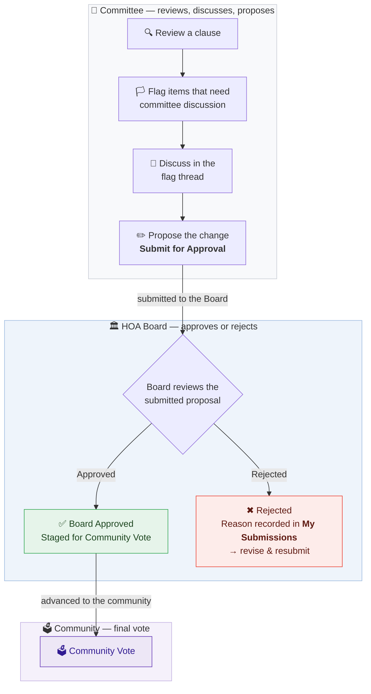

# Committee Member Workflow — PLCA Governing Documents Revision

**Who this is for:** members of the Document Revision Committee — community volunteers, plus a board member and an ARC member — working together to revise Plantation Lakes' governing documents.

**What this tool gives you:** the entire body of governing documents, broken into ~712 individual clauses you can search, read, discuss, and propose changes to. Your flags, discussions, and proposed edits are the raw material for drafting the **new** governing documents. Everything you do is recorded, nothing you do can break the live resident tool, and nothing goes live without approval.

---

## The big picture

**Committee Review → Committee Proposal → Board Approval / Rejection → Community Vote**

You handle the review, discussion, and proposal process inside the committee workflow. Final Board approval happens after your submission: the Board reviews the proposal and either approves or rejects it. If approved by the Board, the proposal is advanced to the community for final voting. If rejected, the reason is recorded in **My Submissions** so the proposal can be revised and resubmitted — a rejection is never a dead end, and the flag thread is where you regroup.

---

## Step 0 — Sign in

1. Go to **hoa-admin.onrender.com** and sign in with the username and temporary password you were given.
2. You'll be required to set your own password on first login.
3. Sessions last 8 hours. Five wrong password attempts locks the account for 15 minutes.

Your role in the tool is **Member**. The sidebar shows exactly what you have access to — if you don't see something mentioned in another guide, it belongs to a different role.

---

## Step 1 — Review the governing documents

The **Clauses** page (home) is the entire governing-document corpus, one clause at a time.

- **Search** by keyword — it looks through clause IDs, citations, document names, summaries, and full clause text.
- **Filter** by document (e.g. just the CC&Rs, just the Builders Guidelines) or by tag (e.g. FENCE, ARC).
- **Click any clause ID badge** to open that clause's own page: full text, plain-English summary, its change history, any open flags, and any pending changes. This is the best page to read before proposing anything.
- **Precedence matters:** every clause has a precedence level, and *lower numbers mean higher authority* — 1 is Texas state law, 2 is the CC&Rs, down to 9 for the Builders Guidelines. When documents conflict, the lower number wins. Keep this in mind when proposing changes: fixing a clause in a low-authority document doesn't help if a higher-authority document contradicts it.
- **Need an offline packet?** The **Export CSV** panel downloads the clause set (honoring your current filters) for committee meetings or offline markup.

The **Help & Reference** expander at the top of the Clauses page documents every feature in detail.

---

## Step 2 — Flag what needs committee attention

Flags are the committee's deliberation tool. A flag never changes any clause — it opens a discussion.

- **Clause flag** — "this specific clause needs revision." Create it from the 🏳 button on any clause card or clause page.
- **Topic flag** — "this whole policy area needs attention" (e.g. fencing rules scattered across four documents). Create it from the **Search** page after running a question: *Flag this topic* captures the question, the bot's answer, and every cited clause in one flag.
- Every flag has a **comment thread**. Make your case there — comments are permanent (they can't be edited or deleted), which is exactly what makes the thread a real committee record.
- Flags move **Open → In Review → Closed** (as *Changed*, *No Change*, or *Deferred*). Flags are closed by reviewers after deliberation — your job is to open them and argue them well.

**Rule of thumb:** if it needs discussion first, flag it. If it's an obvious small fix (a typo, a wrong page number), skip to Step 3.

---

## Step 3 — Propose a change

When the committee's direction is clear (or the fix is obvious), propose the actual change:

1. Open the clause (browse card or clause page) and edit the fields — text, summary, citation, tags, link, page.
2. Click **Submit for Approval**. Three fields are always required: citation, page number, and a Google Drive source link.
3. Your proposal goes into the **Pending** queue. **The live clause does not change** — residents keep seeing the current version until final approval.
4. The system automatically checks your text against the linked source PDF (a ✅/⚠️/❌ verification badge used during final review). It's advisory — it never blocks you.
5. New clauses work the same way (**Add Clause** panel), as do deletion requests (which receive extra scrutiny during final approval).

You cannot approve anything — including your own submissions. That's not a limitation, it's the integrity model: nothing reaches residents without final approval.

---

## Step 4 — Track your submissions

**My Submissions** (sidebar) is your personal ledger:

- Every change you've ever proposed, newest first, with a field-by-field diff of exactly what you proposed.
- Status: **awaiting review**, **approved**, or **rejected**.
- Rejections always include the reviewer's written reason — read it, adjust, and resubmit if you still believe in the change.

Once a change has been approved and takes effect, the resident-facing chatbot reflects it automatically within about an hour.

---

## What you'll never see (and why)

| Not yours | Whose it is | Why |
|---|---|---|
| Approve / reject buttons | The HOA Board | The Board approves or rejects each submitted proposal; approved proposals advance to the community vote. You propose — the Board decides |
| Resident Questions page | Accuracy reviewers | Monitoring the resident tool's accuracy, separate from revision work |
| User and tag management | Administration | Housekeeping of the tool itself, not deliberative |

---

## Etiquette & ground rules

- **One concern per flag.** Ten small flags beat one sprawling one — they can be closed individually.
- **Quote the source.** Clause text is verbatim from recorded documents; proposals should cite where the new language comes from or say plainly that it's new drafting.
- **Don't fight in edits.** If a proposal of yours is rejected and you disagree, take it to the flag thread — not a resubmission war.
- **Everything is audited.** Every action is permanently recorded with your name and a timestamp. Work as if the whole community is reading — because ultimately, they are the ones these documents govern.
